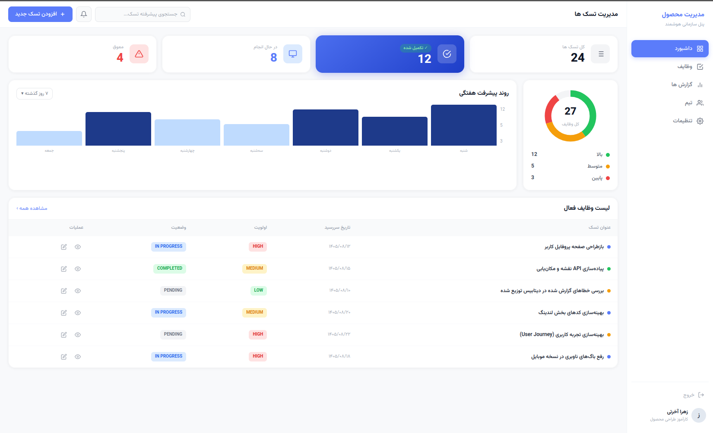

# داشبورد مدیریت تسک‌ها

یه داشبورد سازمانی برای مدیریت وظایف تیمی — طراحی‌شده با HTML، CSS خالص و JavaScript حداقلی.

---

## پیش‌ نمایش



| بخش | توضیح |
|---|---|
| سایدبار | ناوبری اصلی + اطلاعات کاربر |
| کارت‌های آماری | نمایش تعداد کل، تکمیل‌شده، در حال انجام، معوق |
| چارت دونات | توزیع اولویت‌های تسک‌ها |
| چارت میله‌ای | روند پیشرفت هفتگی |
| جدول وظایف | لیست تسک‌ها با امکان جستجو |
| مودال افزودن | فرم ثبت تسک جدید با اعتبارسنجی |

---

## فایل‌ ها

```
Dashboard/
├── index.html   # ساختار HTML — تمام المان‌های صفحه
├── style.css    # استایل‌ها، رنگ‌ها و ریسپانسیو
└── app.js       # رفتارهای تعاملی (مودال، جستجو، همبرگر)
```

---

## اجرا

نیازی به build یا نصب package نیست — فقط فایل `index.html` رو توی مرورگر باز کن.

```bash
open index.html
# یا با VS Code Live Server
```

---

## ویژگی‌ها

- **RTL کامل** — چیدمان راست‌به‌چپ فارسی با `direction: rtl`
- **ریسپانسیو** — سازگار با دسکتاپ، تبلت و موبایل
- **سایدبار کشویی** — روی موبایل با دکمه همبرگر باز/بسته میشه
- **جستجوی زنده** — فیلتر ردیف‌های جدول بدون reload
- **مودال با اعتبارسنجی** — چک کردن عنوان اجباری + پیام خطای inline
- **Toast notification** — پیام موفقیت بعد از ثبت تسک
- **چارت SVG** — دونات و میله‌ای بدون کتابخانه خارجی
- **فونت Vazirmatn** — فونت فارسی استاندارد از Google Fonts

---

## Breakpoint های ریسپانسیو

| عرض صفحه | رفتار |
|---|---|
| بیشتر از ۱۰۲۴px | ۴ کارت آماری در یه ردیف، چارت‌ها کنار هم |
| زیر ۱۰۲۴px | کارت‌ها ۲ ستون، چارت‌ها زیر هم |
| زیر ۷۶۸px | سایدبار تبدیل به کشو میشه، مودال از پایین میاد |
| زیر ۶۰۰px | جستجو مخفی میشه |
| زیر ۴۸۰px | متن دکمه افزودن مخفی میشه، فقط آیکون |

---

## تکنولوژی‌ها

- HTML5 Semantic
- CSS3 (Grid, Flexbox, Custom Properties, Transitions)
- Vanilla JavaScript (ES5)
- SVG (inline charts)
- [Vazirmatn Font](https://fonts.google.com/specimen/Vazirmatn)

---

## نکته RTL

چون `direction: rtl` روی body فعاله، اولین آیتم در CSS Grid و Flexbox **سمت راست** قرار می‌گیره. به همین دلیل ترتیب DOM کارت‌های آماری و ستون‌های جدول با ترتیب بصری فرق داره — این عمدی‌ه.

---

ساخته‌شده توسط **زهرا آخرتی** — کارآموز طراحی محصول، خرداد ۱۴۰۵
